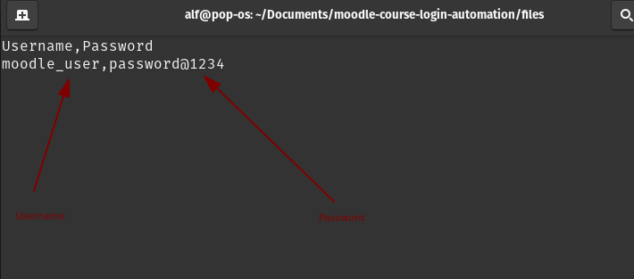
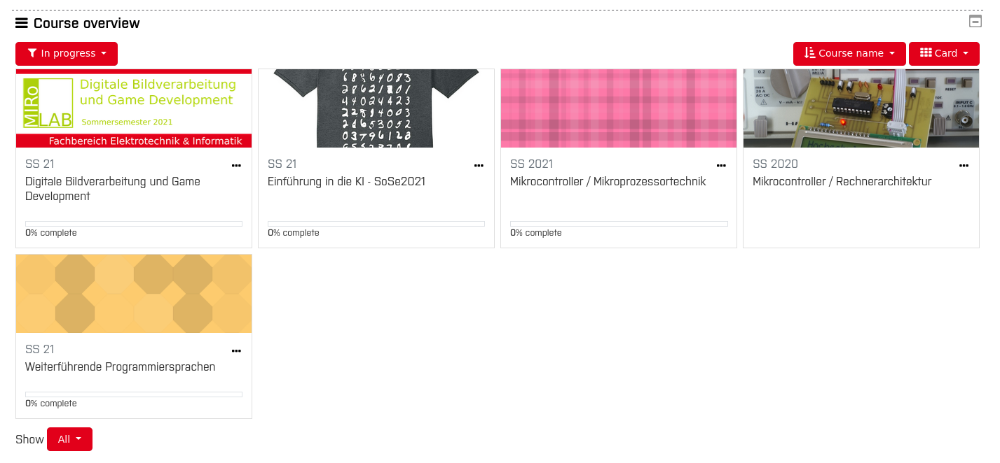
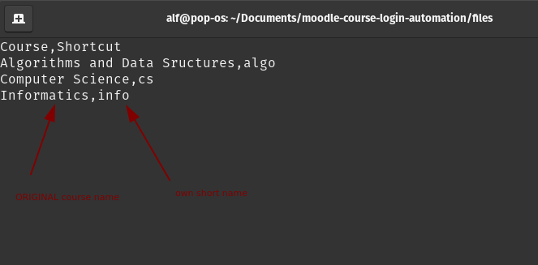

<!-- TABLE OF CONTENTS -->
<details open="open">
  <summary><h2 style="display: inline-block">Table of Contents</h2></summary>
  <ol>
    <li>
      <a href="#about-the-project">About The Project</a>
      <ul>
        <li><a href="#built-with">Built With</a></li>
      </ul>
    </li>
    <li>
      <a href="#getting-started">Getting Started</a>
      <ul>
        <li><a href="#prerequisites">Prerequisites</a></li>
        <li><a href="#installation">Installation</a></li>
      </ul>
    </li>
    <li><a href="#usage">Usage</a></li>
    <li><a href="#contact">Contact</a></li>
  </ol>
</details>


<!-- ABOUT THE PROJECT -->
## About The Project
A script which allows you to open a choosen course automatically on Moodle at **HS Bochum**.


### Built With

* selenium 3.141.0


<!-- GETTING STARTED -->
## Getting Started

To get a local copy up and running follow these simple steps.

### Prerequisites
* Install geckodriver [Firefox]  
  <a>https://github.com/mozilla/geckodriver/releases<a/>
  
   * Setup guide **Linux**    
     <a>https://medium.com/@sonaldwivedi/downloading-and-setting-up-geckodriver-87873e25207c<a/>
  
   * Setup guide **Windows**  
     <a>http://www.learningaboutelectronics.com/Articles/How-to-install-geckodriver-Python-windows.php<a/>


### Installation

1. Clone the repo
   ```sh
   git clone https://github.com/DoganGuendogdu/moodle-course-login-automation.git
   cd moodle-course-login-automation/

   ```
2. Install requirements
   ```sh
   pip3 install -r requirements.txt
   ```
3. Execute script 
  ```sh
   ./main.sh 'your_short_name'
   ```
    or 
   ```sh
   python3 main/main.py 'your_short_name'
   ```
   

<!-- USAGE EXAMPLES -->
## Usage

## 1. Prepare login data 
Open **'files/username_password.csv'** and enter your moodle username and password



## 2. Course overview 
Short names are only available for courses which are listed in the course overview  
Courses can be listed in the card, summary or list format



## 3. Prepare courses
Open **'files/courses.csv'** and list your course names with your own choosen short form.  
The course names have the be exactly like they are given on Moodle.



## Demo
Opening the course "Mikrocontroller / Mikroprozessortechnik" with the short form 'micro'


<!-- CONTACT -->
## Contact
Dogan Guendogdu - @dogan.guendogdu_cs@tutanota.com


